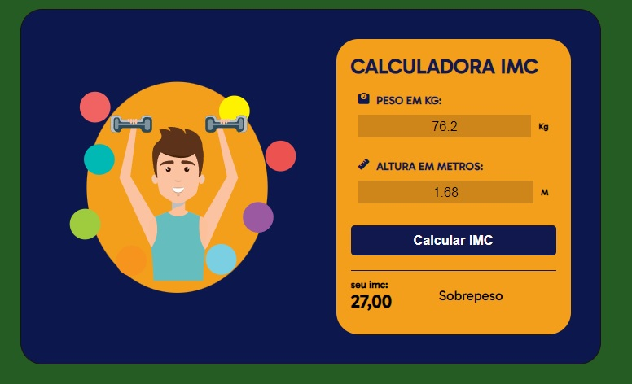
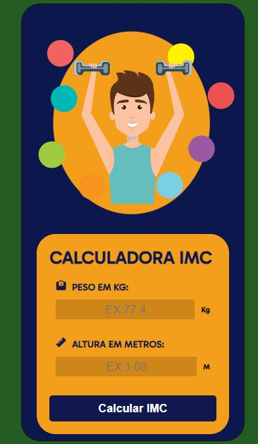

# CALCULADORA IMC

### O que faz?

##### - Mostra seu IMC

##### - Classifica com base do seu IMC.

## Design versão desktop e versão mobile.

 

 
 

### Resultado:

[Clique aqui 😃](https://daniielluiiz.github.io/calculadora-imc/)

### Tecnologias usadas:

- HTML5
- JavaScript
- CSS

### O que aprendi/aprimorei?

- Lógica de programacão (melhorei)
- Melhor uso da responsividade para diversas telas.
